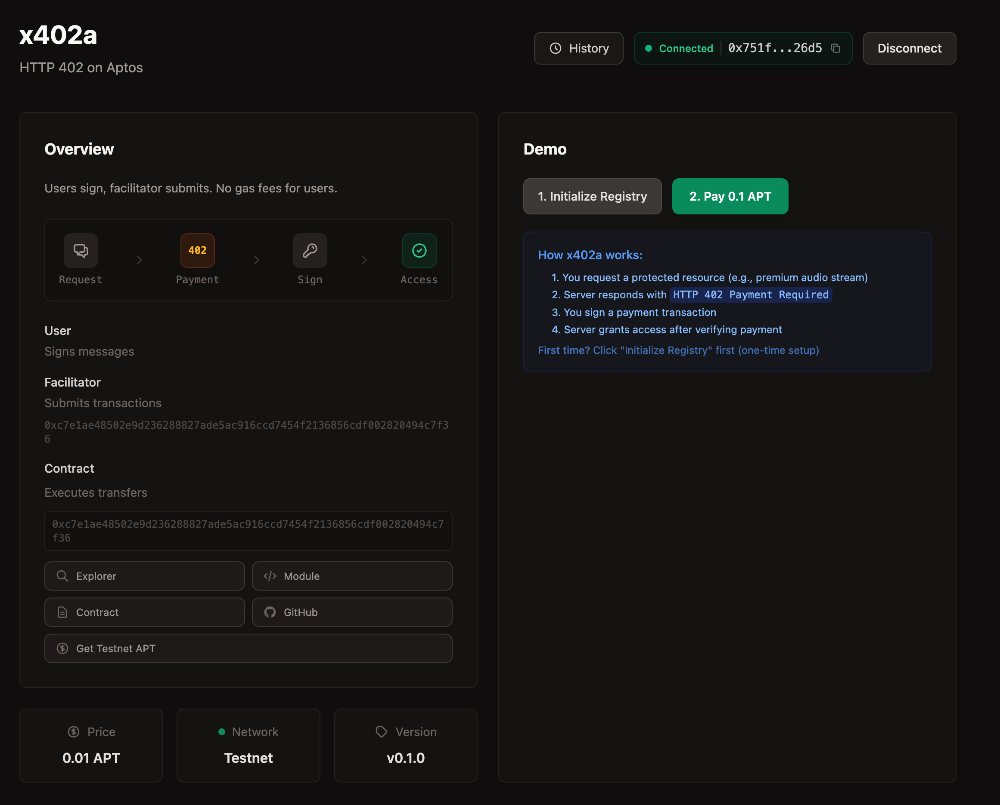
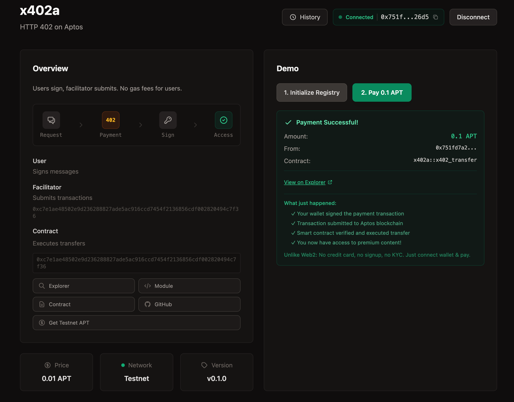

# x402a — HTTP-402 Payments for Aptos

**EXPERIMENTAL - Version 0.1.0**

**Warning**: This is an experimental release. Not recommended for production use with real funds. Use testnet only.

Secure payment-required resources on Aptos using fee payer transactions. User's funds transferred, facilitator pays gas.

## What is x402a?

x402a brings the HTTP 402 Payment Required model to Aptos blockchain. Like [x402](https://x402.org) on Base/Ethereum, x402a enables seamless micropayments where:
- Users sign transactions (no gas fees!)
- Facilitators submit & pay gas via Aptos fee payer mechanism
- Protected resources unlock after payment verification

**x402 → Base/Ethereum** | **x402a → Aptos**

---

##  Demo

### Payment Flow Demo


### Successful Payment


---

##  Quick Start

```bash
npm install x402a x402a-next
```

**Run Example:**
```bash
cd examples/nextjs-app-router
bun install
bun dev  # localhost:3000
```

Fund facilitator via [Testnet Faucet](https://faucet.testnet.aptoslabs.com), then test payments with Petra wallet.

---

##  Usage

### Client (React)

```typescript
import { signTransactionForFeePayer } from "x402a";

// 1. Get 402 response
const res = await fetch("/api/protected");
const { requirements } = await res.json();

// 2. Build transaction
const buildRes = await fetch("/api/facilitator/build", {
  method: "POST",
  body: JSON.stringify({
    from: userAddress,
    to: requirements.payTo,
    amount: requirements.maxAmountRequired,
  }),
});
const { transactionPayload } = await buildRes.json();

// 3. Sign transaction
const { authenticator } = await signTransactionForFeePayer(
  wallet,
  transactionPayload
);

// 4. Submit payment
const payment = {
  x402Version: 1,
  scheme: "exact",
  network: "aptos-testnet",
  payload: {
    from: userAddress,
    to: requirements.payTo,
    amount: requirements.maxAmountRequired,
    nonce: transactionPayload.nonce,
    authenticator,
    validUntil: transactionPayload.validUntil,
    chainId: transactionPayload.chainId,
  },
};

const paymentHeader = Buffer.from(JSON.stringify(payment)).toString("base64");

// 5. Retry with payment
const finalRes = await fetch("/api/protected", {
  headers: { "X-Payment": paymentHeader },
});
```

### Server (Next.js API)

```typescript
import { X402Facilitator } from "x402a/server";
import { generateSecureNonce, calculateExpirationTimestamp, getChainIdFromNetwork } from "x402a/server";

const facilitator = new X402Facilitator({
  privateKey: process.env.FACILITATOR_PRIVATE_KEY,
  contractAddress: process.env.CONTRACT_ADDRESS,
  network: "testnet",
});

// Build transaction for client
export async function POST(req: Request) {
  const { from, to, amount } = await req.json();

  const txPayload = await facilitator.buildTransactionForClient({
    from,
    to,
    amount,
    nonce: generateSecureNonce(),
    validUntil: calculateExpirationTimestamp(3600),
    chainId: getChainIdFromNetwork("aptos-testnet"),
    contractAddress: process.env.CONTRACT_ADDRESS,
  });

  return Response.json({ transactionPayload: txPayload });
}

// Submit payment
export async function POST(req: Request) {
  const { payment } = await req.json();

  const result = await facilitator.submitPayment({
    from: payment.payload.from,
    to: payment.payload.to,
    amount: payment.payload.amount,
    nonce: payment.payload.nonce,
    authenticator: payment.payload.authenticator,
    validUntil: payment.payload.validUntil,
    chainId: payment.payload.chainId,
  });

  return Response.json({
    success: result.success,
    txHash: result.txHash,
  });
}
```

### Middleware (Next.js)

```typescript
import { paymentMiddleware } from "x402a-next/middleware";

export const middleware = createPaymentMiddleware({
  payTo: process.env.PAYMENT_RECIPIENT_ADDRESS,
  routes: {
    "/api/protected": {
      price: "1000000", // 0.01 APT
      description: "Protected API endpoint",
    },
    "/api/premium/*": {
      price: "5000000", // 0.05 APT
    },
  },
  facilitator: {
    url: process.env.NEXT_PUBLIC_FACILITATOR_URL,
  },
});
```

---

##  Security Model

### Fee Payer Architecture

```
User Signs Transaction → Facilitator Signs as Fee Payer → Blockchain Validates
         ↓                         ↓                              ↓
  User's Funds              Pays Gas Only                Transfers APT
   Transferred                                          (User → Recipient)
```

### Security Features

 **User's funds transferred** (not facilitator's!)
 **Facilitator pays gas only** (via fee payer)
 **Expiration protection** (`valid_until` timestamp)
 **Replay protection** (nonce + chain ID)
 **Integer overflow protection** (u128 arithmetic)
 **Recipient limits** (max 10 per transaction)
 **Balance pre-checks**
 **Zero address prevention**

---

##  Monorepo Structure

```
x402a/
├── packages/
│   ├── x402a/              # Core SDK
│   │   ├── src/client/     # Client-side signing
│   │   ├── src/server/     # Facilitator server
│   │   └── src/types/      # TypeScript types
│   ├── x402a-next/         # Next.js middleware
│   └── x402a-contract/     # Move smart contract
└── examples/
    └── nextjs-app-router/  # Example Next.js app
```

---

##  Move Contract

### Entry Functions

```move
// Single recipient payment
public entry fun transfer_sponsored(
    user: &signer,          // User signs
    to: address,
    amount: u64,
    nonce: vector<u8>,
    valid_until: u64,       // Unix timestamp
    chain_id: u8,           // 1=mainnet, 2=testnet, 3=devnet
)

// Multi-recipient (up to 10)
public entry fun transfer_sponsored_split(
    user: &signer,
    recipients: vector<address>,
    amounts: vector<u64>,
    nonce: vector<u8>,
    valid_until: u64,
    chain_id: u8,
)

// One-time setup per account
public entry fun initialize_registry(account: &signer)
```

### Test Results

**8/8 Move tests passing** 
**37 facilitator tests passing** 
**26 middleware tests passing** 

```bash
cd packages/x402a-contract
aptos move test
```

---

##  Deployment

### 1. Deploy Contract

```bash
cd packages/x402a-contract

# Compile
aptos move compile --named-addresses x402a=<YOUR_ADDRESS>

# Test
aptos move test  # Should show 8/8 passing

# Deploy to testnet
aptos move publish --profile testnet --named-addresses x402a=<YOUR_ADDRESS>

# Save contract address!
```

### 2. Configure Environment

```bash
# .env.local
NEXT_PUBLIC_APTOS_NETWORK=testnet
NEXT_PUBLIC_CONTRACT_ADDRESS=0x...  # From deployment
FACILITATOR_PRIVATE_KEY=0x...       # Facilitator account
PAYMENT_RECIPIENT_ADDRESS=0x...     # Where payments go
```

### 3. Fund Facilitator

Facilitator needs APT for gas (not for transfers):

```bash
# Testnet: https://faucet.testnet.aptoslabs.com
# Request: 10 APT
```

### 4. Initialize User Registry

Each user must initialize once:

```typescript
await wallet.signAndSubmitTransaction({
  data: {
    function: `${contractAddress}::x402_transfer::initialize_registry`,
    functionArguments: [],
  },
});
```

---

##  How It Works

### Payment Flow

```
1. Client → Request → Server
              ↓
2. Server → 402 Required → Client
              ↓
3. Client → Build Transaction → Facilitator API
              ↓
4. Client → Sign Transaction → Wallet
              ↓
5. Client → Submit Payment → Server
              ↓
6. Server → Submit as Fee Payer → Blockchain
              ↓
7. Blockchain → Validate & Execute → Transfer User's APT
              ↓
8. Server → Grant Access → Client
```

### Key Differences from Traditional Web3

| Traditional | x402a |
|-------------|-------|
| User pays gas | Facilitator pays gas |
| User waits for confirmation | Server handles confirmation |
| Complex UX | Simple: Sign & Access |
| Gas price volatility | Predictable experience |

---

##  Gas Costs

| Operation | Gas Cost | Paid By |
|-----------|----------|---------|
| Initialize registry | ~0.0001 APT | User (one-time) |
| Single payment | ~0.0001 APT | Facilitator |
| Split payment (10) | ~0.0002 APT | Facilitator |

**User only pays the transfer amount!** 

---

##  Use Cases

- **Pay-per-article** — Unlock premium content
- **API metering** — Pay per API call
- **Streaming payments** — Micropayments per second
- **Tips & donations** — Easy tipping for creators
- **Premium features** — Unlock app functionality
- **Data access** — Pay for database queries

---

##  Documentation

- **IMPLEMENTATION_COMPLETE.md** - Complete implementation guide
- **DEPLOYMENT_CHECKLIST.md** - Detailed deployment steps
- **SECURITY_IMPLEMENTATION_COMPLETE.md** - Security audit report
- **Move contract** - Inline documentation in source

---

##  Roadmap

### v0.2.0 (Planned)
- Fungible Assets support
- React hooks (`useX402Payment`)
- TypeScript unit tests

### v0.3.0 (Planned)
- Subscription support (recurring payments)
- Batch payments
- Price oracle integration

### v1.0.0 (Stable)
- Production-ready release
- Mainnet deployment guide
- Performance optimizations

---

##  Contributing

This is an experimental release. Feedback and contributions welcome!

- **Issues**: [GitHub Issues](https://github.com/yourorg/x402a/issues)
- **Examples**: See `examples/` directory
- **Tests**: `aptos move test` in `packages/x402a-contract`

---

##  License

MIT

---

**Version**: 0.1.0 (Experimental)
**Status**: Experimental - Testnet Only
**Last Updated**: 2025-11-14
